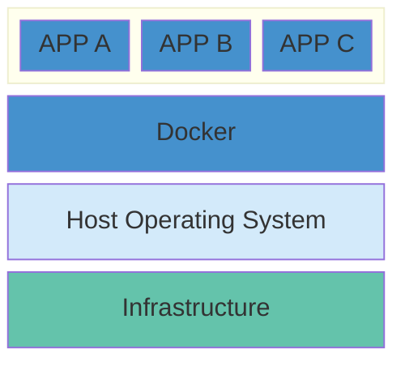
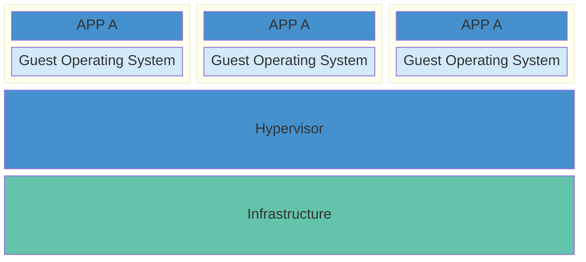

# 概括

**容器**是软件的标准单元，是应用程序层的一个抽象，它将代码和依赖关系打包在一起，以便应用程序在不同的计算环境之间快速可靠地运行。多个容器可以运行在同一台机器上，并与其他容器共享操作系统内核，每个容器都作为用户空间中的独立进程运行。容器比 VM 占用更少的空间，可以处理更多的应用程序。



**虚拟机**（VM）是将一台服务器转换为多台服务器的物理硬件的抽象。Hypervisor 允许多个 VM 在一台机器上运行。每个 VM 都包含一个操作系统、应用程序、必要的二进制文件和库的完整副本，这些文件占用了数十 GB，VM 启动也可能很慢。



Docker 是一个把开发的应用程序自动部署到容器的开源引擎，Docker 在虚拟化的容器执行环境中增加了一个应用程序部署引擎，用来提供一个轻量、快速的环境用来运行开发者的程序。

Docker 核心组件：

- Docker 客户端和服务器

  Docker是一个 C/S 架构的程序，Docker 客户端只需要向 Docker 服务器或守护进程发出请求，服务器或守护进程将完成所有工作并返回结果。

- Docker 镜像

  用户基于**镜像**（image）来运行自己的容器，镜像是 Docker 生命周期的「构建」部分。

- Registry

  Docker 使用 Registry 来保存用户构建的镜像，Registry 分为公共和私有两种，Docker 公司运营的公共 Registry 叫做 Docker Hub，用户可以分享保存自己的镜像。

- Docker 容器

  容器是基于镜像启动的，容器可以运行一个或多个进程，容器是 Docker 生命周期的「启动」阶段。每个容器都包含一个软件镜像，容器中的软件可以进行一些操作，如创建、启动、关闭和销毁。Docker 在执行操作时，不关心容器中到底塞进了什么，所有容器都按照相同的方式将内容装载进去。

# 安装

参考官网[安装说明](https://docs.docker.com/engine/install/)，或者镜像站[安装说明](https://mirrors.tuna.tsinghua.edu.cn/help/docker-ce/)。

# 镜像

## 获取镜像

```shell
# 从registry中下载一个镜像，如果不指定tag，默认会选择latest标签，下载仓库中最新版本
docker pull NAME[:TAG]
# 可以选择从其他注册服务器的仓库下载
docker pull REGISTRY/NAME[:TAG]
```

## 查看镜像信息

```shell
# 查看已有的镜像
docker images
# 指定tag，起到别名的作用
docker tag SOURCE_IMAGE[:TAG] TARGET_IMAGE[:TAG]
# 查看指定镜像的详细信息
docker inspect NAME|ID
```

## 搜索镜像

```shell
# 搜索镜像，默认搜索官方仓库中的镜像
docker search TEAM
```

## 删除镜像

```shell
# 删除镜像
docker rmi NAME[:TAG]
# 删除所有指向该镜像的标签，然后删除镜像，当该镜像创建的容器存在时，镜像文件默认是无法删除的，可以使用-f参数强制删除
docker rmi ID
```

> 不推荐使用`-f`强制删除一个存在容器依赖的镜像，这样可能会造成一些遗留问题。

## 创建镜像

1. 基于已有镜像的容器创建

    ```shell
    docker commit [OPTIONS] CONTAINER [REPOSITORY[:TAG]]
    ```

2. [基于 Dockerfile 创建](#Dockerfile)

## 导出和导入镜像

```shell
# 保存一个或者多个镜像到tar归档文件
docker save [OPTIONS] IMAGE [IMAGE...]
```

- `-o`：写入到目标文件。例如`docker save -o mysql.tar mysql:5.7`，也可以这样写`docker save IMAGE_1 IMAGE_2 > images.tar`。

```shell
# 从tar包或者输入流中加载一个镜像
docker load [OPTIONS]
```

- `-i`：从目标文件中读取内容，也可以这样写`docker load < mysql.tar`。

> 这将导入镜像以及相关的元数据信息（包括标签等）。

## 上传镜像

```shell
# 默认上传到Docker Hub官方仓库
docker push NAME[:TAG]
```


# 容器

## 查看容器

```shell
# 查看容器，默认显示正在运行的容器
docker ps [OPTIONS]
```

- `-a`：显示所有容器。

## 创建容器

```shell
# 创建容器
docker create [OPTIONS] IMAGE [COMMAND] [ARG...]
# 启动容器
docker start CONTAINER
```

使用`docker create`新建的容器处于停止状态，可以使用`docker start`来启动。

```shell
# 从一个镜像中创建和运行一个容器
docker run [OPTIONS] IMAGE [COMMAND] [ARG...]
```

使用这个命令来启动创建并启动容器时，Docker 在后台运行的操作如下：

1. 检查本地是否存在指定镜像，不存在就在公共仓库下载。
2. 使用镜像创建并启动一个容器。
3. 分配文件系统，并在只读的镜像层外面挂载一层可读可写层。
4. 从宿主主机配置的网桥接口中桥接一个虚拟接口到容器中。
5. 从地址池配置一个 IP 地址给容器。
6. 执行完用户指定的应用程序。
7. 执行完后容器被终止。

> 当容器中指定的应用程序终结时，容器也会自动终止。例如启动一个终端：`docker run -it ubuntu /bin/bash`，当退出这个终端时这个容器也就处于终止状态。

---

常用命令选项如下：

- `-t`：分配一个伪终端并绑定到容器的标准输入流，通常与`-i`一起使用。
- `-i`：保持标准输入流一直打开。
- `-d`：在后台运行容器同时打印容器ID。
- `--name`：给容器分配一个名字。
- `-p`：指定端口映射，例如`-p 80:90`，将容器的80端口映射到主机的90端口。
- `-P`：随机端口映射，容器内部端口映射到主机随机端口。
- `--rm`：退出时自动移除容器。
- `-v`：创建一个数据卷，多次使用可以创建多个数据卷。
- `--volumes-from`：从其他容器中挂载数据卷。

```shell
# 已交互式方式启动rabbitmq
docker run -it --rm --name rabbitmq -p 5672:5672 -p 15672:15672 rabbitmq
```

> 按住`Ctrl+P` 后再按`Ctrl+Q`可以退出交互式终端，但是不结束进程。
>
> 按住`Ctrl+D`会让容器内的进程结束，进而会终止容器。

## 终止容器

```shell
# 停止运行中的容器
docker stop [OPTIONS] CONTAINER [CONTAINER...]
# 重启容器
docker restart CONTAINER
```

## 进入容器

```shell
docker attach CONTAINER
# 在容器内启动新进程
docker exec [OPTIONS] CONTAINER COMMAND [ARG...]
```

使用 attach 时，当多个窗口同时 attach 到一个容器的时候，所有窗口都会同步显示，当某个窗口因命令阻塞时，其他窗口就无法执行操作了。更常见的是使用`docker exec`，例如：`docker exec -it ubuntu /bin/bash`。

## 删除容器

```shell
docker rm [OPTIONS] CONTAINER [CONTAINER...]
```

- `-f`：强制终止并删除一个容器。
- `-l`：删除容器的连接，但保留容器。
- `-v`：删除容器挂载的数据卷。

## 导入和导出容器

```shell
# 导出容器文件系统到一个归档文件
docker export [OPTIONS] CONTAINER
```

`-o`：写入到目标文件。也可以这样写：`docker export > archive.tar`。可将这些文件传输到其他机器上，实现容器的迁移。

```shell
# 导入容器
docker import [OPTIONS] file|URL|- [REPOSITORY[:TAG]]
```

导出的文件可以使用`docker import`命令导入，成为镜像。例如：`cat mysql.tar | docker import - mysql:v2 `。

> `docker export`导出的是容器快照，体积略小于`docker save`命令导出的，会丢失所有的历史记录和元数据信息（即仅保存容器当时的快照状态）。此外，容器快照文件导入时可以重新指定标签等元数据信息。

# 仓库

## 私有仓库


# 数据管理

用户在使用 Docker 过程中，往往需要查看容器内应用产生的数据，或者需要把容器内的数据进行备份，甚至多个容器之间进行数据的共享，这些涉及到容器的数据管理操作，容器中管理数据主要有两种方式：**数据卷**和**数据卷容器**。

## 数据卷

数据卷（*Data Volumes*）是一个可供容器使用的特殊目录，它绕过系统文件，可以提供很多特性：

- 数据卷可以在容器之间共享和重用。
- 对数据卷的修改会立马生效。
- 对数据卷的更新不会影响容器。
- 数据卷会一直存在，直到没有容器使用。

```shell
# 查看所有数据卷
docker volume ls
# 删除所有未使用的的本地数据卷
docker volume prune
```

在使用`docker run`命令时可以使用`-v`选项来创建一个数据卷，多次使用`-v`可以创建多个数据卷。

```shell
docker run -v /dir IMAGE
```

可以指定挂载一个本地已有的目录到容器中作为数据卷，本地目录的路径必须是绝对路径。

```shell
docker run -v /dir:/dir IMAGE
```

也可以从主机挂载单个文件到容器中作为数据卷。

```shell
docker run -v ~/file:/file IMAGE
```

> Docker 挂载数据卷的默认权限是读写`rw`，可以通过`ro`指定为只读，例如`-v /dir:/dir:ro`，这样容器内挂载的数据卷的数据就无法修改了。

## 数据卷容器

如果需要在容器之间共享一些持续更新的数据，可以使用**数据卷容器**。数据卷容器就是一个普通的容器，专门用它提供数据卷供其他容器挂载使用。

```shell
# 创建一个数据卷容器dbdata，并在其中创建一个数据卷挂载到/dbdata中
docker run -it -v /dbdata --name dbdata ubuntu
# 在其他容器中来挂载dbdata容器中的数据卷
docker run -it --volumes-from dbdata --name db1 ubuntu
docker run -it --volumes-from dbdata --name db2 ubuntu
```

此时容器 db1 和 db2 都挂载同一个数据卷到相同的`/dbdata`目录，这三个容器任何一方在该目录下的写入，其他容器都可以看见。

如果删除了挂载的容器，数据卷并不会被自动删除，如果要删除一个数据卷，必须在删除最后一个还挂载着它的容器时使用`docker rm -v CONTAINER`来指定同时删除关联的容器。

# 网络配置

在启动容器时，如果不指定对应参数，在容器外部是无法通过网络来访问容器内的网络应用和服务的。要让外部访问容器内部的应用，可以通过`-P`或`-p`选项来指定端口映射。当使用`-P`标记时，Docker 会随机映射一个49000~49900的端口至容器内部开放的网络端口。

## 端口映射

1. 映射所有接口地址

    使用`hostPort:containerPort`格式将本地端口映射到容器的端口。此时会绑定本地所有接口上的所有地址。

2. 映射到指定地址的指定端口

    使用`ip:hostPort:containerPort`格式指定映射使用一个特定地址。

3. 映射指定地址的任意端口

    使用`ip::containerPort`绑定指定地址的任意端口到容器的端口，指定的地址会自动分配一个端口。

> 可以使用 udp 标记来指定 udp 端口。例如`5000:5000/udp`。

```shell
# 列出容器的端口映射
docker port CONTAINER
```

# Dockerfile

Dockerfile 由一行行命令语句组成，`#`开头的为注释行。一般 Dockerfile 分为四部分：基础镜像信息、维护者信息、镜像操作指令和容器启动时执行指令。


## 指令

指令的一般格式为`INSTRUCTION arguments`，指令如下：

1. `FROM`

    ```dockerfile
    FROM <image>
    ...
    FROM <image>:<tag>
    ```

    第一条指令必须为`FROM`，如果在同一个 Dockerfile 中创建多个镜像时，可以使用多个 From 指令（每个镜像一次）。

2. `MAINTAINER`

    ```dockerfile
    # 指定维护者信息
    MAINTAINER <name>
    ```

3. `RUN`

4. `CMD`

5. `EXPOSE`

6. `ENV`

7. `ADD`

8. `COPY`

9. `ENTRYPOINT`

10. `VOLUME`

11. `USER`

12. `WORKDIR`

13. `ONBUILD`


## 创建镜像

